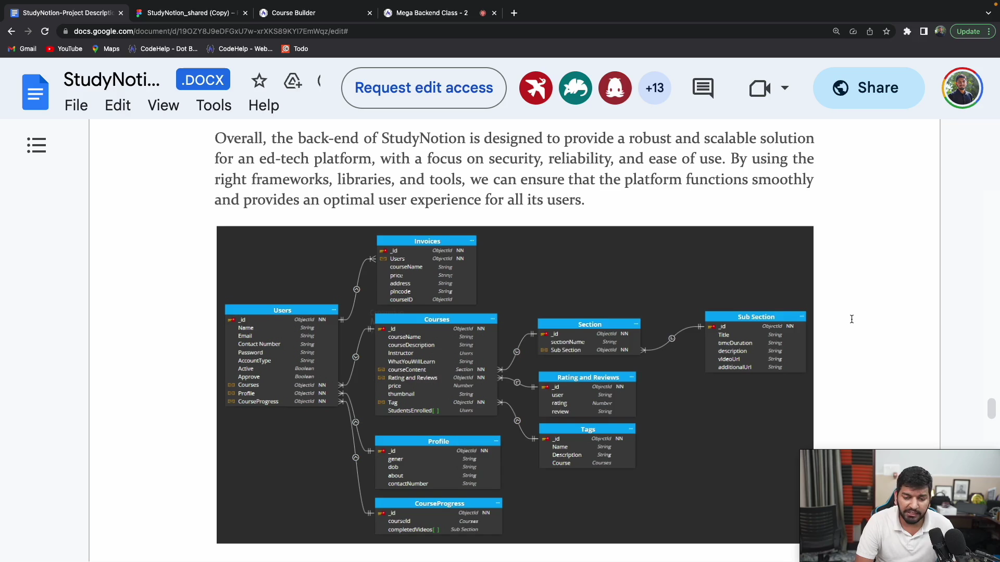

<!-- eneter email -> clickonresetPassword -> checkyouremail -> take a link of reseting a password

new account = email verficatiion ke liye OTP verify karenge tabhi signup hoga

Login -< email, password>

SignupPage -  <name, lastname, email, number, 2 password > -> Email OTP verify -> create account

same for Student and Instruter both

OTP model mei email bhejna hai DB ke entry hone se pahle mei bhejna chahta hu jiske liye mujhe pre save hook karna padega

<-----^---------video-1----------^-------> 
<!-- <---------------video-2------------------# Study-Notion-Project -->
